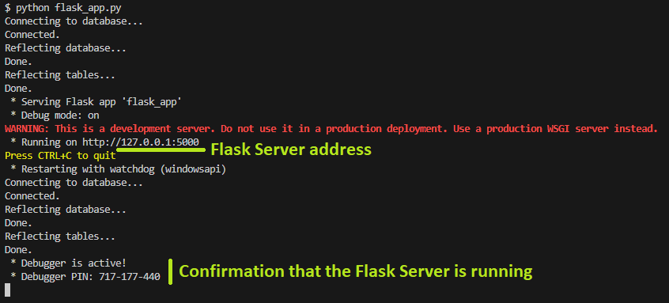
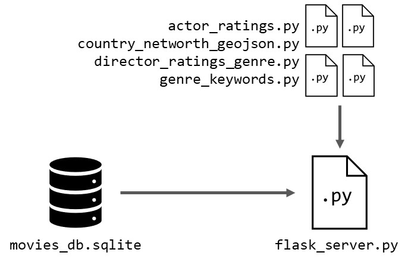
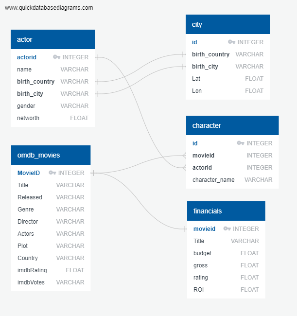
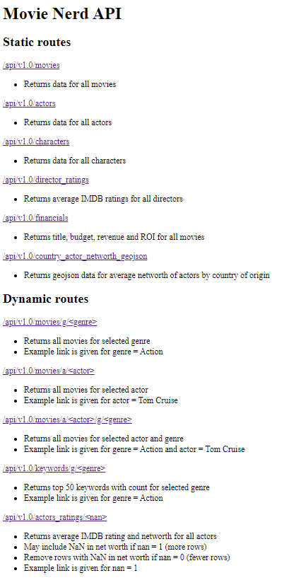
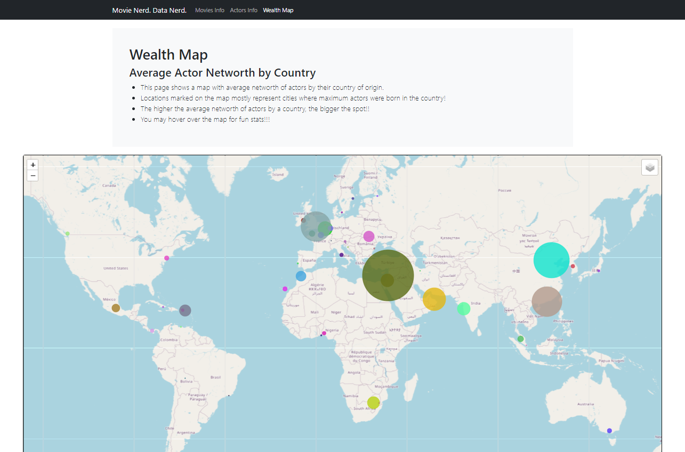

# Movie Nerd. Data Nerd.
Repository for Monash University Bootcamp Project 3 (Group 7)

## Prerequesites
### API keys
- Create a module named `config.py` in `/ETL` with a variable called `omdb_api_key` containing your OMDB API key
- Add a variable called `geoapify_key` and containing your GeoAPIfy key in `config.py`

## How to run this project from scratch
The project contained in this repository is ready to run once the prerequesites are met.

However, if you would like to start with a blank sheet, the following steps can be followed 

### Preparation
- Delete `movies_db.sqlite` in `/Server`
- Delete all CSV files in `/Datasets` except `actor.csv`, `character.csv` and `movies.csv`

### Steps (from `/ETL` directory)
1. Run `ETL_omdb_to_csv.ipynb`, make sure that `omdb.csv` is created in `/Dataset`
2. Run `ETL_movies_to_db.ipynb`, make sure that `movies_db.sqlite` is created in `/Server`
3. Run `ETL_financials_to_db.ipynb`
4. Run `ETL_country_city_to_csv.ipynb`, make sure that `country_coordinates.csv` is created in `/Dataset`
5. Run `ETL_geodata_to_db.ipynb`
6. Run `ETL_check.ipynb` and make sure that all tests are passed

## How to run the dashboard
### Launch the dashboard
To start the dashboard, simply open `index.html` in `/docs` in any browser. By default, the dashboard uses a version of the API (same code and same functions) that is hosted on [PythonAnywhere](https://www.pythonanywhere.com/) so the Flask Server is not needed. To use the web-hosted API, make sure that the first lines of code in `common.js` in `/docs/static/js` are commented out as shown below:

```JavaScript
//const api_base_url = 'http://127.0.0.1:5000/api/v1.0/'; // Use this for locally-run API (Flask Server must be running)
const api_base_url = 'https://spiderdwarf.pythonanywhere.com/api/v1.0/'; // Use this for web-hosted API
```

To use the local Flask Server instead, please follow the instructions in the next subsection.

### Start Flask Server (optional)
1. Navigate to `/Server`
2. Start Flask by using the command `python flask_app.py`
3. Check your console to make sure Flask is running
4. Navigate to the address indicated in the console

See below for the expected output when running the Flask Server.



If the local Flask Server is used, make sure to change the first lines of code in `common.js` in `/docs/static/js` in the following way:

```JavaScript
const api_base_url = 'http://127.0.0.1:5000/api/v1.0/'; // Use this for locally-run API (Flask Server must be running)
//const api_base_url = 'https://spiderdwarf.pythonanywhere.com/api/v1.0/'; // Use this for web-hosted API
```

## File structure and operational logic
### Directories
- `DataExploration` contains files used early in the project to explore the data and functions to be used later
- `Datasets` contains all the CSV files extracted or created as part of the ETL process
- `docs` contains the HTML, JavaScript and CSS used to create the Dashboard
- `img` contains the images used in this README
- `Server` contains the ETL Jupyter notebooks, the Flask code and the Python modules used in the Flask app, and the SQLite database

### `DataExploration` directory
The files in the `DataExploration` directory were used at the very beginning of the project and serve various purposes:
1. Open and display the data from the different CSV files
2. Analyse some trends and display the data for qualitative analysis
3. Prepare prototypes of some functions to be used in the ETL process and in the Flask Server

These files are as self-explanatory as possible but they are secondary to the finished project and not required to run either of the ETL process files, Flask Server or the dasboard itself. They are provided for the sake of completeness only.

### `Dataset` directory
- `actor.csv` is downloaded from the Movies and Actors database, by James Gaskin on data.world: https://data.world/jamesgaskin/movies (James Gaskin dataset)
- `character.csv` is downloaded from the James Gaskin dataset
- `country_coordinates.csv` is created as part of the ETL process
- `movies.csv` is downloaded from the James Gaskin dataset
- `omdb_movies.csv` is created as part of the ETL process
- `omdb.csv` is obtained by calling the OMDB API: http://www.omdbapi.com/?

### `docs` directory
- `/static/js` contains all the JavaScript code for the dashboard
- `/static/css` contains all the CSS stylesheet for the dashboard
- `index.html` is the home page of the dashboard
- `info_actors.html` contains the actors visualisations
- `info_movies.html` contains the actors visualisations
- `map.html` contains geolocation visualisation

### `Server` directory
The server side is composed of two parts:
- The ETL files used to extract the data from the data sources and populate the database
- The Flask code used to get data from the database and expose the API used by the dashboard

The Flask code uses the files shown in the diagram below:



- `flask_server.py` is the main code. To run flask locally, use the command `python flask_server.py` from within `/Server`
- The other python files are local modules used for different functions used in `flask_server.py`
- `movies_db.sqlite` is the database containing all the data used in the dashboard and exposed by the API

The ERD for the database is shown below:



The tables are more extensive but only the main columns used in the dashboard are shown here for simplicity. Due to the short timeline of this project, only little time has been given to the data engineering steps and the tables are not as normalised or optimised as they could be. This has been noted as an area of focus for future work.

## Dataflow
### Overview
The dataflow is shown in the diagram below:


- The ETL files are used to extract the data from the three main data sources and save it into the SQLite database
- The database, as well as the Flask code can be executed locally, but are also copied to [PythonAnywhere](https://www.pythonanywhere.com/) to expose the API through the internet
- The API is generated by the Flask app and export the data from the database as JSON or GeoJSON files

### Flask and API
The API [home page](https://spiderdwarf.pythonanywhere.com/) is shown below (the API may look different depending on the current version):



The API exposes various static and dynanmic routes that are detailed on the API home page.

## Dashboard
The dashboard contains three pages:
1. The home page: [index.html](https://benoitchamot.github.io/MONU_project3/) contains information about the movies return on investment (ROI), a tag cloud of words found in the movies summaries (filtered by genre) and the most successful directors (by IMDB ratings and gross revenue; also filtered by genre.)
2. The actors info page: [info_actors.html](https://benoitchamot.github.io/MONU_project3/info_actors.html) contains information about the actors such as the Top 10 acors by rating and number of movies, the distribution of actors per rating and networth, a scatter plot of Net Worth vs IMDb Rating, and an overview of the wealth gap between the richest male and female actors.
3. The wealth map page: [map.html](https://benoitchamot.github.io/MONU_project3/map.html) shows a map with markers showing the average net worth of the actors born in different countries (see below)




## Data engineering
### Data sources
We gathered data from three different open and free sources:
- Movies and Actors database, by James Gaskin on data.world: https://data.world/jamesgaskin/movies
- OMDB API: http://www.omdbapi.com/?
- GeoAPIfy

The James Gaskin's dataset includes information about 636 movies as well as their characters and the actors who play them. 

### Data management
The James Gaskin's dataset was retrieved from data.world by writing an SQL query to get each table and download the result as a CSV file. The three files `actor.csv`, `character.csv` and `movies.csv` are saved in the `Datasets` directory.

Using the titles from the movies in the James Gaskin's dataset, queries were made to the OMDB API to retrieve additional information about the movies as well as data already present in the James Gaskin's dataset to cross-check the values. Because the call to the API to retrieve all 636 movies take some time, the data are added to a DataFrame and saved as a CSV file (`Datasets/omdb.csv`). The code used to perform these actions can be found in `data_management.ipynb`.


## Data analysis
### Research questions
Our main research question is: What Makes A Movie Succesful?

We define the success of a movie by two metrics:
1. IMDB ratings
2. Gross revenue

We look at different variables that can influence these metrics:
1. Actor wealth: do richer (i.e. potentially more succesful) actors act in movies with better ratings?
2. Directors: do certain directors get better IMDB ratings for their movies, or generate more revenue?
3. Budget: do movies with a higher budget get better reviews? Do they generate more revenue?

### Analysis
We conducted various analyses on the cleaned and transformed dataset, including:
- Calculated the average rating for each actor by aggregating the ratings of the movies they appeared in.
- Calculated the pay gap between male and female actors by comparing the average earnings of male actors to female actors.
- Compared ratings to budget, gross, and ROI to identify any trends or correlations.
- Identifying the best director based on the average IMDb rating of their movies.
- Analyzing the relationship between budget, gross, and ROI with movie ratings.

### Data visualization
These visualizations were created using Python libraries such as Matplotlib . They were designed to effectively convey the insights and findings gained from the data analysis process; In a clear and concise manner. Visualizations include bar charts, and pie charts to effectively communicate the findings and insights.
- Bar charts: We used bar charts to compare the average ratings of male and female actors. This visualization helped us understand the differences in ratings between the two groups.
- Pie charts: We used pie charts to showcase the distribution of actor among different contries. 
- GeoJson this type of visualization can provide insights into the global distribution of actors, and help identify any geographical patterns or trends. It can also be useful for making comparisons between regions and understanding the impact of location on the film industry.

## Conclusion
Through this project, we successfully gathered and integrated data from different sources, performed data cleaning and transformation tasks, conducted data analysis, and created visualizations to gain insights about the movies and actors dataset. The project highlights the importance of data engineering in organizing and analyzing large datasets to extract valuable information.

The findings from this project can be used to make informed decisions in the film industry, such as casting choices, budget allocation, and identifying successful directors and actors.

We also looked at the Gender Wealth Gap (difference between the net worth of male and female actors)
- The wealth of the Top 100 richest male actors is compared to the wealth of the Top 100 richest female actors
- We find that the richest female actor (Reese Witherspoon) has a net worth of 50% of the richest male actor (Tom Cruise): 300M USD compared to 600M USD
- Reese Witherspoon is less rich than the Top 15 men
- The male actors' average net worth is $39,556,492
- The female actors' average net worth is $29,617,704 (75% of Male actors' net worth)

## Limitations
- The number of actors in the dataset is limited
- The sources for the net worth data in the James Gaskin dataset are unclear and may not be accurate
- The same goes for the movies budget and gross revenue and these data should be validated with alternate sources

## Future work
- Better normalisation and structure for the tables in the database, make better use of foreign keys instead of repeating data